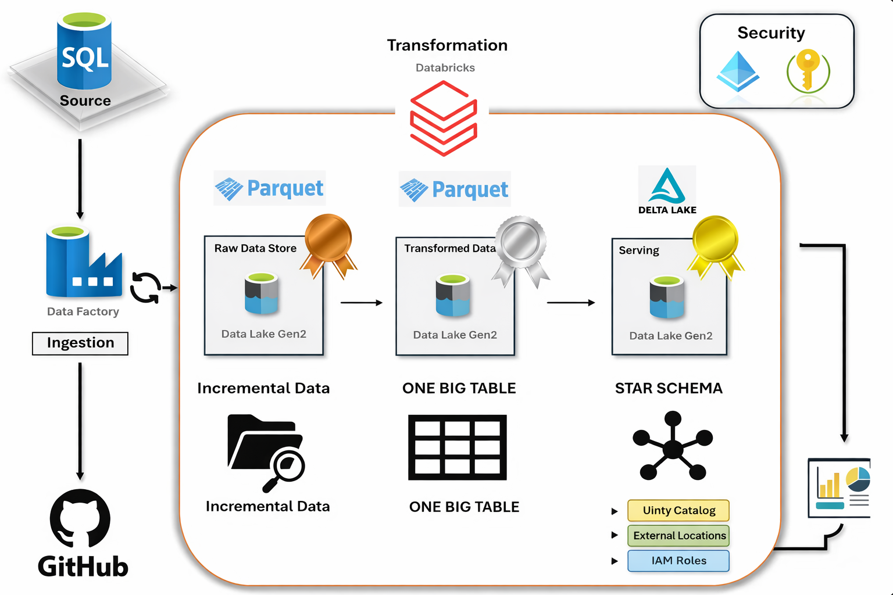

# End-to-End Car Sales Data Pipeline on Azure

---

## Overview

This project demonstrates an end-to-end Data Engineering pipeline built on Azure, implementing the **Medallion Architecture (Bronze, Silver, Gold)**. It covers data ingestion, incremental loading using watermarking, transformation using PySpark, and analytics-ready data modeling using a Star Schema.

---

## Architecture

---

## Tech Stack

- Azure Data Factory (ADF)
- Azure SQL Database
- Azure Data Lake Gen2 (ADLS)
- Azure Databricks (PySpark)
- Delta Lake
- Unity Catalog

---

## Pipeline Flow

### 1. Data Ingestion
- Source data from **git** is loaded into **Azure SQL Database**
- ADF pipeline extracts and loads data into ADLS (Bronze layer)

### 2. Incremental Loading
- Implemented watermarking using `last_load_date`
- Lookup activity retrieves last processed timestamp
- Only new data is ingested in each run

### 3. Bronze Layer
- Raw data stored in Parquet format in ADLS

### 4. Silver Layer
- Data cleaning and transformations using PySpark:
  - Derived columns (Model Category)
  - Revenue per unit calculation
  - Date key generation

### 5. Gold Layer (Star Schema)
- Designed analytics-ready data model:
  - Fact table: `fact_table`
  - Dimension tables:
    - `dim_branch`
    - `dim_dealer`
    - `dim_model`
    - `dim_date`

### 6. Data Processing
- PySpark used for transformations
- Delta Lake used for storage
- Delta MERGE implemented for upsert operations

### 7. Orchestration
- Azure Data Factory triggers Databricks notebooks using job activity

### 8. Governance & Security
- Unity Catalog used for centralized data governance
- External locations configured for ADLS access
- IAM roles assigned for secure data access

---

## Data Model

- **Fact Table**
  - `fact_table` → Revenue, Units Sold, Revenue per unit

- **Dimension Tables**
  - `dim_branch`
  - `dim_dealer`
  - `dim_model`
  - `dim_date`

---

## Key Features

- Incremental data loading using watermarking
- Medallion Architecture (Bronze, Silver, Gold)
- Star Schema data modeling
- Delta Lake upserts using MERGE
- Parameterized ADF pipelines
- End-to-end orchestration using Azure services

---

## Future Improvements

- Implement SCD Type 2 for historical tracking  
- Add Power BI dashboard for reporting  
- Introduce data quality validation checks  

---

## Project Walkthrough
- For a complete set of screenshots, see the [Screenshots Walkthrough](Screenshots/Readme.md).

## Author
Rahul R Nair (Learning Project for Data Engineering)
