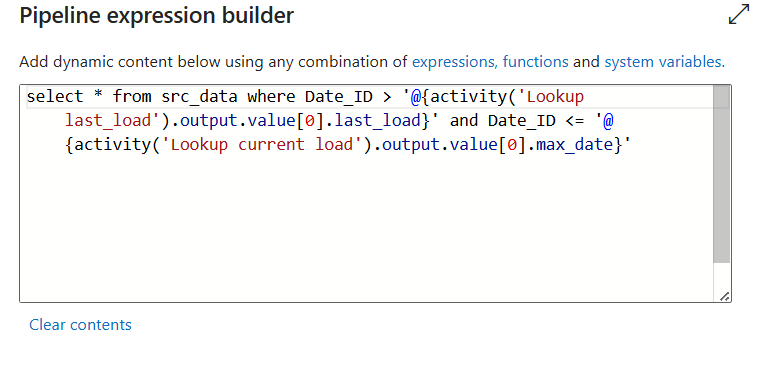
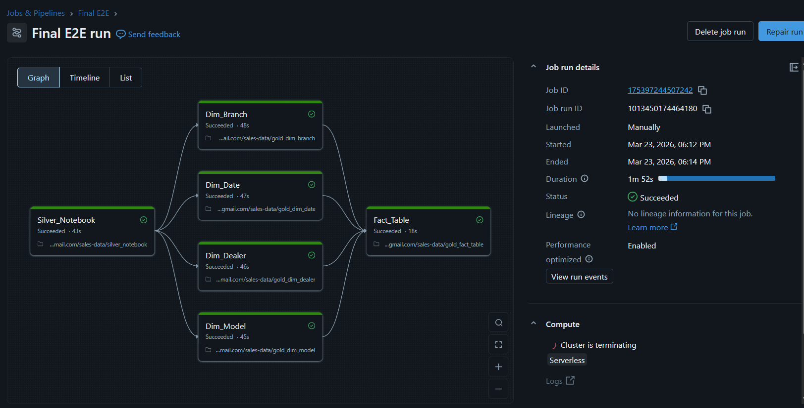
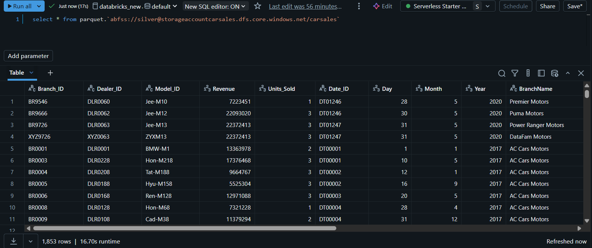
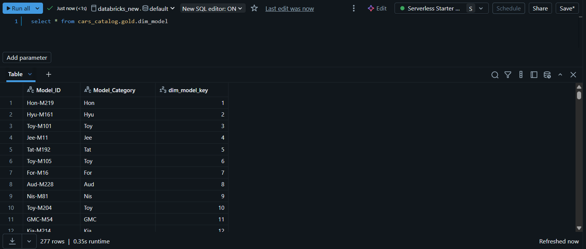
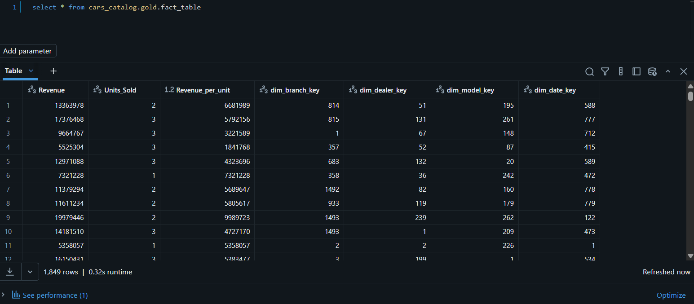

# Project Walkthrough – Car Sales Data Pipeline

## 1. ADF Pipeline Overview

**ADF Pipeline (Initial & Incremental)**

This pipeline orchestrates the entire workflow including:
- Lookup activity to fetch last load date
- Copy activity for incremental load
- Stored procedure to update watermark

---

## 2. Lookup Activity (Watermark)

Retrieves `last_load` from tracking table used for incremental loading.

---

## 3. Copy Activity (Incremental Load)

Filters data using:
- Greater than last load date
- Less than or equal to current load date

Loads data into Bronze layer (ADLS).

---

## 4. Databricks Job 

ADF triggers Databricks notebooks for transformation.

---

## 5. Silver Layer Output

Data cleaned and transformed using PySpark:
- Derived columns
- Revenue calculations
- Date key generation

Sample processed **Silver** data is available for reference:
- [Silver Layer Sample](../Silver%20Layer%20Files/silver%20csv.csv)
---

## 6. Gold Layer (Star Schema)

Final output includes:
- Fact table: fact_sales
- Dimension tables

Sample processed **Gold** data is available for reference:
- [Gold Layer dim-branch](../Gold%20Layer%20Files/dim-branch-csv.csv)
- [Gold Layer dim-date](../Gold%20Layer%20Files/dim_date_csv_1.csv)
- [Gold Layer dim-model](../Gold%20Layer%20Files/dim-model-csv-1.csv)
- [Gold Layer dim-dealer](../Gold%20Layer%20Files/dim-dealer-csv-1.csv)
- [Gold Layer fact-table](../Gold%20Layer%20Files/fact-table-csv-1.csv)
---

